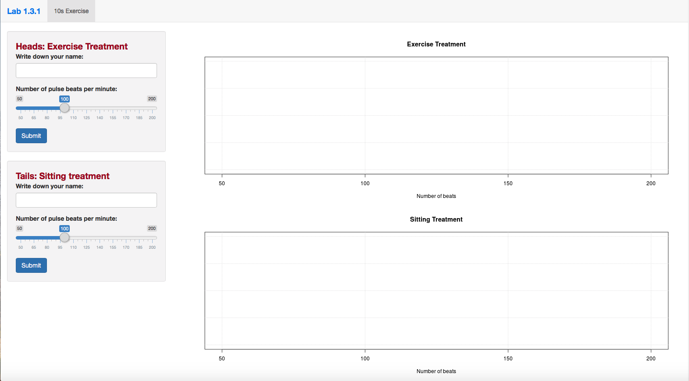

# Shiny Applications for STAT 200 Labs

This repository contains a series of R shiny apps developed by **Likun Zhang**, who was a GTA for three sessions during fall semester 2018. These apps were used to facilitate participation during labs and encourage them to actually perform the experiments in the lab activities.

R shiny applications have two components, a user interface object and a server function, that are passed as arguments to the shinyApp function that creates a Shiny app object from this UI/server pair. The source code for both of these components is listed in this repository for each app.

> To learn more about R shiny, see this amazing [tutorial](https://shiny.rstudio.com/articles/basics.html) .

## App 1. Is just 10 seconds of exercise enough to increase pulse?

As a class, we are going to perform a randomized experiment to answer this question. There will be two treatment groups: Exercise and Sitting, and one response variable: pulse (beats/minute). We will randomly assign treatments by flipping a coin.

Students will come to the podium and use the lab computer to input their names and results, which will be recorded in the shiny app accumulatively. The results will be shown on the right panel as dotplots in real time.

